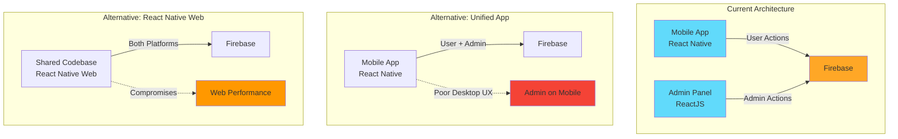

# Architectural Decisions and Tradeoffs

## Overview

This document analyzes the five most significant architectural decisions made in the Instagram Clone application, examining the rationale, benefits, and tradeoffs of each choice.

---

## Decision 1: Firebase as Backend-as-a-Service (BaaS)

### Decision
Use Firebase (Firestore, Cloud Functions, Authentication, Storage) as the complete backend infrastructure instead of building a custom backend with traditional servers and databases.

### Rationale
- Rapid development and time-to-market
- Managed infrastructure reduces operational overhead
- Built-in real-time capabilities
- Integrated authentication and authorization
- Automatic scaling and high availability

### Benefits ✅

1. **Development Speed**: Eliminated need to build authentication, database, storage, and API layers from scratch
2. **Cost Efficiency**: Pay-per-use pricing model, no upfront infrastructure costs
3. **Scalability**: Automatic scaling without manual intervention
4. **Real-time Sync**: Native real-time database updates for chat and feed features
5. **Security**: Built-in security rules and authentication mechanisms
6. **Maintenance**: No server maintenance, patching, or infrastructure management

### Tradeoffs ⚖️

1. **Vendor Lock-in**: Heavy dependency on Firebase ecosystem makes migration difficult and expensive
2. **Cost at Scale**: Pricing can become expensive with high read/write operations and storage
3. **Limited Query Flexibility**: Firestore has limitations on complex queries (no OR queries, limited array operations)
4. **Cold Start Latency**: Cloud Functions can experience cold start delays (500ms-2s)
5. **Debugging Complexity**: Distributed serverless architecture harder to debug than monolithic systems
6. **Data Export**: More difficult to perform bulk operations or data migrations
7. **Customization Limits**: Constrained by Firebase's capabilities and update schedule

### Alternatives Considered
- **Custom Node.js/Express + MongoDB**: More control but higher development and maintenance cost
- **AWS Amplify**: Similar BaaS but steeper learning curve
- **Supabase**: Open-source alternative but less mature ecosystem

---

## Decision 2: React Native with Expo for Mobile Development

### Decision
Build the mobile application using React Native with Expo managed workflow instead of native iOS/Android development or other cross-platform frameworks.

### Rationale
- Single codebase for iOS and Android
- JavaScript/React ecosystem familiarity
- Expo provides managed build and deployment pipeline
- Rich library of pre-built components and APIs
- Hot reloading for faster development

### Benefits ✅

1. **Code Reusability**: ~95% code sharing between iOS and Android
2. **Development Speed**: Faster iteration with hot reloading and unified codebase
3. **Team Efficiency**: Single team can build for both platforms
4. **Expo Ecosystem**: Easy access to camera, notifications, image picker without native configuration
5. **OTA Updates**: Push JavaScript updates without app store review (within limits)
6. **Lower Cost**: Reduced development and maintenance costs vs. two native apps

### Tradeoffs ⚖️

1. **Performance**: Slower than native apps for complex animations and heavy computations
2. **App Size**: Larger bundle size (~30-50MB) compared to native apps
3. **Expo Limitations**: Managed workflow restricts access to some native modules
4. **Native Module Dependencies**: Requires ejecting to bare workflow for custom native code
5. **Update Lag**: New iOS/Android features take time to be supported
6. **Debugging Challenges**: Bridge between JavaScript and native code adds complexity
7. **Third-party Library Compatibility**: Not all React Native libraries work with Expo

### Alternatives Considered
- **Native iOS (Swift) + Android (Kotlin)**: Best performance but 2x development cost
- **Flutter**: Better performance but smaller ecosystem and Dart language learning curve
- **Ionic/Cordova**: Web-based approach with lower performance

---

## Decision 3: Redux for State Management

### Decision
Use Redux with Redux Thunk for global state management instead of React Context API, MobX, or other state management solutions.

### Rationale
- Predictable state container with single source of truth
- Time-travel debugging capabilities
- Middleware support for async operations
- Large ecosystem and community support
- Well-established patterns for React applications

### Benefits ✅

1. **Predictability**: Unidirectional data flow makes state changes traceable
2. **Debugging**: Redux DevTools provide powerful debugging and time-travel capabilities
3. **Testability**: Pure reducers are easy to test in isolation
4. **Middleware**: Redux Thunk enables async action creators for API calls
5. **Persistence**: Easy to implement state persistence with redux-persist
6. **Community**: Extensive documentation, tutorials, and third-party libraries

### Tradeoffs ⚖️

1. **Boilerplate**: Requires significant boilerplate code (actions, reducers, action creators)
2. **Learning Curve**: Concepts like reducers, actions, and middleware can be complex for beginners
3. **Over-engineering**: May be overkill for simple state management needs
4. **Performance**: Can cause unnecessary re-renders if not optimized with selectors
5. **Verbosity**: Simple state updates require multiple files and functions
6. **Bundle Size**: Adds ~10KB to bundle size (small but notable)

### Alternatives Considered
- **React Context API**: Simpler but can cause performance issues with frequent updates
- **MobX**: Less boilerplate but more "magic" and harder to debug
- **Zustand**: Simpler API but smaller ecosystem and less mature
- **Recoil**: Modern approach but still experimental and Facebook-specific

---

## Decision 4: Nested Firestore Collections for Posts

### Decision
Structure posts using nested collections (`/posts/{userId}/userPosts/{postId}`) instead of a flat collection structure (`/posts/{postId}`).

### Rationale
- Logical grouping of posts by user
- Easier to query all posts by a specific user
- Simplified security rules per user
- Natural data hierarchy matches domain model

### Benefits ✅

1. **Query Efficiency**: Fast retrieval of all posts by a specific user
2. **Security**: Easier to write security rules based on user ownership
3. **Data Organization**: Logical grouping reflects real-world relationships
4. **Deletion**: Easier to delete all user data (GDPR compliance)
5. **Billing**: Potentially lower costs for user-specific queries

### Tradeoffs ⚖️

1. **Global Feed Complexity**: Difficult to query all posts across all users efficiently
2. **Collection Group Queries**: Requires collection group queries which are more expensive
3. **Indexing**: Need to create composite indexes for collection group queries
4. **Pagination**: More complex pagination across multiple user collections
5. **Aggregation**: Harder to perform analytics across all posts
6. **Denormalization**: Requires duplicating post data in feed collection for performance
7. **Query Limitations**: Cannot easily sort all posts by creation time without collection groups

### Alternatives Considered
- **Flat Collection**: `/posts/{postId}` - Simpler global queries but harder user-specific queries
- **Hybrid Approach**: Flat collection with userId field - More flexible but requires careful indexing
- **Separate Collections**: User posts and global feed as separate collections - More duplication

### Impact on Application

```mermaid
flowchart LR
    A[User Profile View] -->|Fast Query| B[/posts/userId/userPosts]
    C[Global Feed View] -->|Slow Query| D[Collection Group Query]
    D -->|Requires| E[Composite Index]
    C -->|Alternative| F[/feed Collection]
    F -->|Denormalized| G[Duplicate Post Data]
    
    style A fill:#4caf50
    style C fill:#ff9800
    style D fill:#f44336
    style F fill:#2196f3
```

---

## Decision 5: Separate Admin Panel (ReactJS) vs. Mobile-Only Admin

### Decision
Build a separate web-based admin panel using ReactJS instead of implementing admin features within the mobile app or using Firebase Console directly.

### Rationale
- Better UX for administrative tasks on desktop
- Separation of concerns between user and admin interfaces
- Easier to implement complex data tables and bulk operations
- More efficient for moderators working on desktop computers

### Benefits ✅

1. **User Experience**: Desktop interface better suited for administrative tasks
2. **Productivity**: Faster content moderation with keyboard shortcuts and larger screens
3. **Security**: Admin features isolated from user-facing mobile app
4. **Flexibility**: Can add complex features (analytics dashboards, bulk operations) more easily
5. **Access Control**: Easier to manage admin permissions separately
6. **Development**: Can use different UI libraries optimized for web (Material-UI, data tables)

### Tradeoffs ⚖️

1. **Code Duplication**: Cannot share components between React Native and ReactJS
2. **Maintenance Overhead**: Two separate codebases to maintain and deploy
3. **Consistency**: Need to ensure UI/UX consistency across platforms
4. **Development Cost**: Additional time to build and maintain separate application
5. **Authentication**: Need to manage admin authentication separately
6. **API Surface**: Need to ensure Firebase security rules work for both apps
7. **Deployment**: Two separate deployment pipelines to manage

### Alternatives Considered
- **Admin Features in Mobile App**: Simpler but poor UX for desktop users
- **Firebase Console Only**: Free but limited customization and poor UX
- **React Native Web**: Share code but compromises on web-specific optimizations
- **Third-party Admin Tools**: Tools like Retool but less customization

### Architecture Comparison



---

## Summary Matrix

| Decision | Primary Benefit | Primary Tradeoff | Risk Level |
|----------|----------------|------------------|------------|
| Firebase BaaS | Development Speed | Vendor Lock-in | Medium |
| React Native + Expo | Cross-platform Code Reuse | Performance Limitations | Low |
| Redux | Predictable State Management | Boilerplate Overhead | Low |
| Nested Collections | User-specific Query Performance | Global Query Complexity | Medium |
| Separate Admin Panel | Desktop UX Optimization | Code Duplication | Low |

## Recommendations for Future Consideration

1. **Firebase**: Monitor costs and consider migration strategy if scaling becomes expensive
2. **React Native**: Evaluate ejecting to bare workflow if native features are needed
3. **Redux**: Consider Redux Toolkit to reduce boilerplate in future development
4. **Data Structure**: Implement feed collection for better global query performance
5. **Admin Panel**: Explore code sharing strategies (shared business logic, API clients)

---

**Last Updated**: 2024
**Document Owner**: Architecture Team
