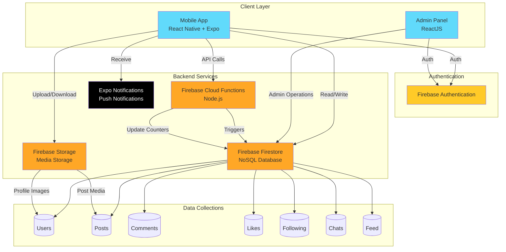
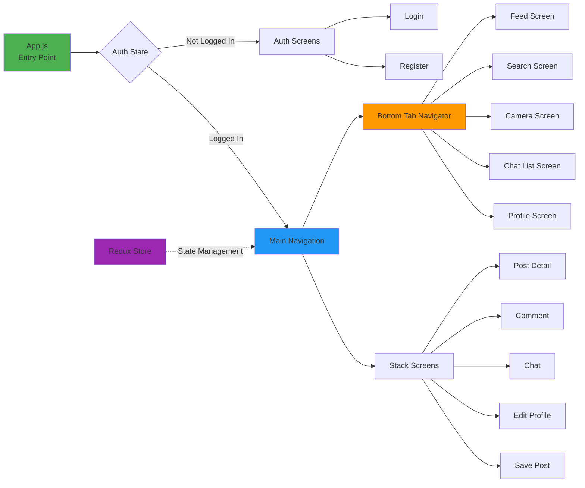
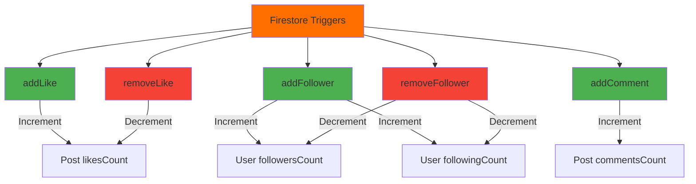

# Instagram Clone - Architecture Documentation

## System Overview

This Instagram Clone is a full-stack social media application built with React Native (mobile), ReactJS (admin panel), and Firebase backend services.

## High-Level Architecture

The following diagram provides a high-level overview of the system architecture:

The architecture consists of three main layers:

1. **Client Layer**: Mobile app (React Native + Expo) and Admin Panel (ReactJS)
2. **Authentication**: Firebase Authentication for user management
3. **Backend Services**: Cloud Functions, Firestore Database, Storage, and Push Notifications

## Architecture Diagram

## Component Architecture

### Mobile Application (Frontend)

## Backend Cloud Functions

The Firebase Cloud Functions handle real-time data updates and maintain data consistency:

### Function Triggers

## Data Model

### Core Collections

1. **Users**
   - Profile information
   - Follower/Following counts
   - Ban status

2. **Posts**
   - Organized by user: `/posts/{userId}/userPosts/{postId}`
   - Contains: images/videos, captions, timestamps
   - Counters: likes, comments

3. **Likes**
   - Path: `/posts/{userId}/userPosts/{postId}/likes/{userId}`

4. **Comments**
   - Path: `/posts/{userId}/userPosts/{postId}/comments/{commentId}`

5. **Following**
   - Path: `/following/{userId}/userFollowing/{followingId}`

6. **Chats**
   - Direct messaging between users
   - Real-time message updates

7. **Feed**
   - Aggregated posts for user timeline

## Technology Stack

### Frontend (Mobile)
- **Framework**: React Native with Expo SDK 42
- **Navigation**: React Navigation 5
- **State Management**: Redux + Redux Thunk
- **UI Components**: React Native Paper, Material Bottom Tabs
- **Media**: Expo Camera, Image Picker, Video Player
- **Notifications**: Expo Notifications

### Admin Panel
- **Framework**: ReactJS 17
- **UI Library**: Material-UI, Bootstrap
- **Routing**: React Router DOM

### Backend
- **Runtime**: Node.js
- **Functions**: Firebase Cloud Functions
- **Database**: Firebase Firestore (NoSQL)
- **Storage**: Firebase Storage
- **Authentication**: Firebase Authentication

## Security

### Firestore Rules
- User data: Read by all, write by owner or admin
- Posts: Read by all, write by owner or admin
- Likes: Write by authenticated user
- Comments: Write by authenticated users
- Following: Write by owner
- Chats: Read/write by participants only

### Storage Rules
- Profile images: Read by all, write by owner
- Post media: Read by all, write by owner

## Key Features

1. **User Authentication**
   - Email/password registration and login
   - Session management

2. **Social Features**
   - Post creation (images/videos)
   - Like and comment on posts
   - Follow/unfollow users
   - User search
   - Direct messaging

3. **Media Management**
   - Camera integration
   - Image and video upload
   - Media library access
   - Video thumbnails

4. **Real-time Updates**
   - Live chat messages
   - Push notifications
   - Feed updates

5. **Admin Panel**
   - User management
   - Content moderation
   - Ban/unban users

## Deployment

- **Mobile App**: Expo managed workflow
- **Admin Panel**: Web hosting (static site)
- **Backend**: Firebase Cloud Functions (serverless)
- **Database**: Firebase Firestore (managed)
- **Storage**: Firebase Storage (managed)

## Scalability Considerations

- Firestore automatic scaling
- Cloud Functions auto-scaling
- CDN for media delivery via Firebase Storage
- Optimized queries with proper indexing
- Pagination for large data sets
