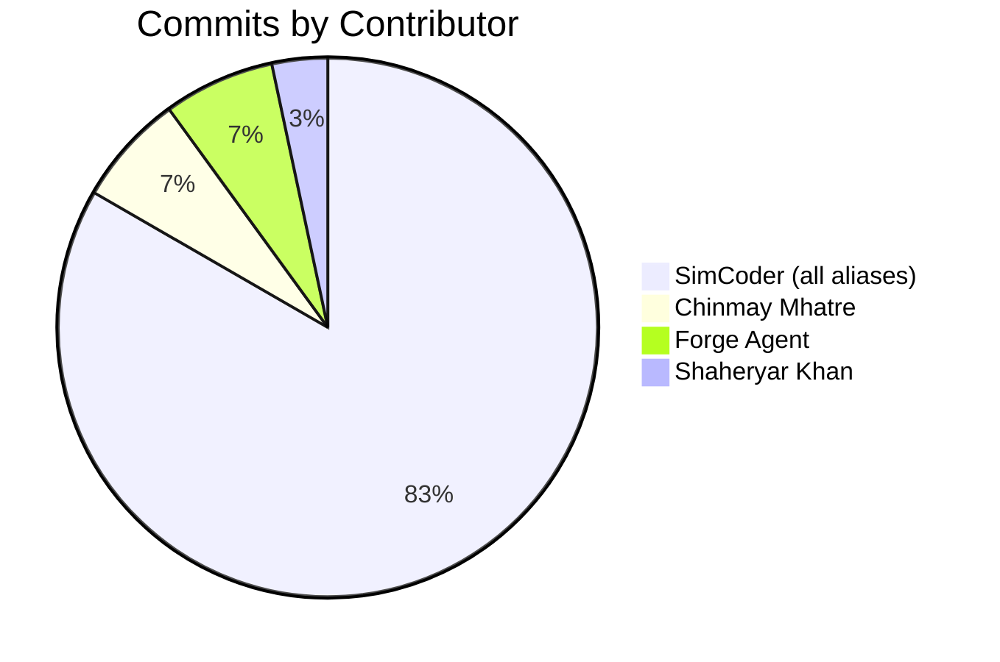
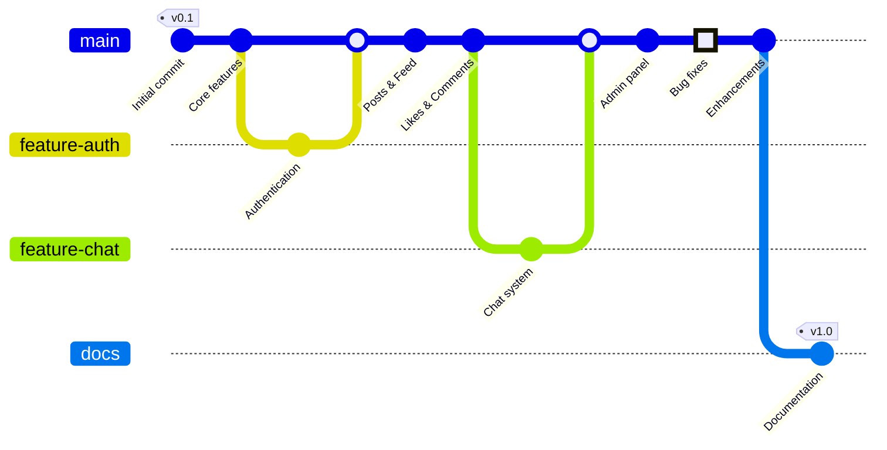

# Contributors

This document recognizes all individuals who have contributed to the Instagram Clone project.

## Project Overview

**Repository**: InstagramClone  
**Organization**: fc-wwt  
**Project Type**: Full-stack social media application (React Native + Firebase)  
**Started**: September 2020

---

## Core Contributors

### SimCoder (Project Lead & Primary Developer)
- **Email**: simplecodervideos@gmail.com
- **GitHub**: simcoderyoutube, SimCoder, SimCoderYoutube, simcoder
- **Contributions**: 25+ commits
- **Role**: Project creator and primary maintainer
- **Period**: September 2020 - January 2022
- **Key Contributions**:
  - Initial project setup and architecture
  - Mobile app development (React Native)
  - Firebase backend integration
  - Admin panel development
  - Core features implementation (posts, likes, comments, chat)
  - Authentication and user management
  - Media upload and storage integration

### Chinmay Mhatre
- **Email**: chinmaymhatre12@gmail.com
- **GitHub**: Chinmay Mhatre
- **Contributions**: 2 commits
- **Period**: August 2021
- **Key Contributions**:
  - Feature enhancements
  - Bug fixes and improvements

### Shaheryar (Shery) Khan
- **Email**: sykhan88@gmail.com
- **GitHub**: Shaheryar(Shery) Khan
- **Contributions**: 1 commit
- **Period**: February 2021
- **Key Contributions**:
  - Code contributions and improvements

### Forge Agent (Documentation & Infrastructure)
- **Email**: forge-agent@users.noreply.github.com
- **GitHub**: Forge Agent
- **Contributions**: 2 commits
- **Period**: September 2024
- **Key Contributions**:
  - Architecture documentation
  - Health endpoint implementation
  - Backend configuration
  - Architectural decision documentation

---

## Contribution Statistics



## Timeline



---

## How to Contribute

We welcome contributions from the community! Here's how you can help:

### Getting Started

1. **Fork the repository**
   ```bash
   git clone https://github.com/fc-wwt/InstagramClone.git
   ```

2. **Create a feature branch**
   ```bash
   git checkout -b feature/your-feature-name
   ```

3. **Make your changes**
   - Follow the existing code style
   - Write clear commit messages
   - Test your changes thoroughly

4. **Submit a pull request**
   - Describe your changes clearly
   - Reference any related issues
   - Wait for review and feedback

### Contribution Areas

- 🐛 **Bug Fixes**: Report or fix bugs
- ✨ **Features**: Implement new features
- 📝 **Documentation**: Improve docs and examples
- 🎨 **UI/UX**: Enhance user interface
- ⚡ **Performance**: Optimize code and queries
- 🧪 **Testing**: Add tests and improve coverage
- 🔒 **Security**: Identify and fix security issues

### Code of Conduct

- Be respectful and inclusive
- Provide constructive feedback
- Help others learn and grow
- Follow project guidelines

---

## Recognition

### Special Thanks

- **SimCoder** for creating and maintaining this educational project
- **YouTube Community** for feedback and feature requests
- **Open Source Community** for libraries and tools used in this project

### Technologies Used

This project wouldn't be possible without these amazing open-source projects:

- React Native & Expo
- Firebase (Google)
- Redux & React Navigation
- Material-UI & React Native Paper
- And many more (see package.json)

---

## Contact

### Project Maintainer
- **Name**: SimCoder
- **Email**: simplecodervideos@gmail.com
- **YouTube**: [SimCoder Channel](https://youtube.com/@simcoder)

### Repository
- **GitHub**: [fc-wwt/InstagramClone](https://github.com/fc-wwt/InstagramClone)
- **Issues**: [Report a bug or request a feature](https://github.com/fc-wwt/InstagramClone/issues)
- **Pull Requests**: [Submit your contribution](https://github.com/fc-wwt/InstagramClone/pulls)

---

## License

This project is open source and available for educational purposes. Please check the repository for specific license information.

---

**Last Updated**: September 2024  
**Total Contributors**: 4  
**Total Commits**: 30+  
**Active Since**: September 2020

---

## Contributor Breakdown

| Contributor | Commits | First Contribution | Last Contribution | Primary Focus |
|-------------|---------|-------------------|-------------------|---------------|
| SimCoder | 25+ | Sep 2020 | Jan 2022 | Full-stack development |
| Chinmay Mhatre | 2 | Aug 2021 | Aug 2021 | Feature enhancements |
| Forge Agent | 2 | Sep 2024 | Sep 2024 | Documentation & infrastructure |
| Shaheryar Khan | 1 | Feb 2021 | Feb 2021 | Code improvements |

---

*Thank you to everyone who has contributed to making this project better! 🙏*
