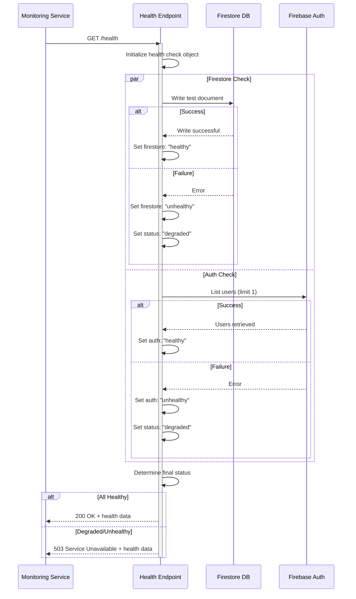
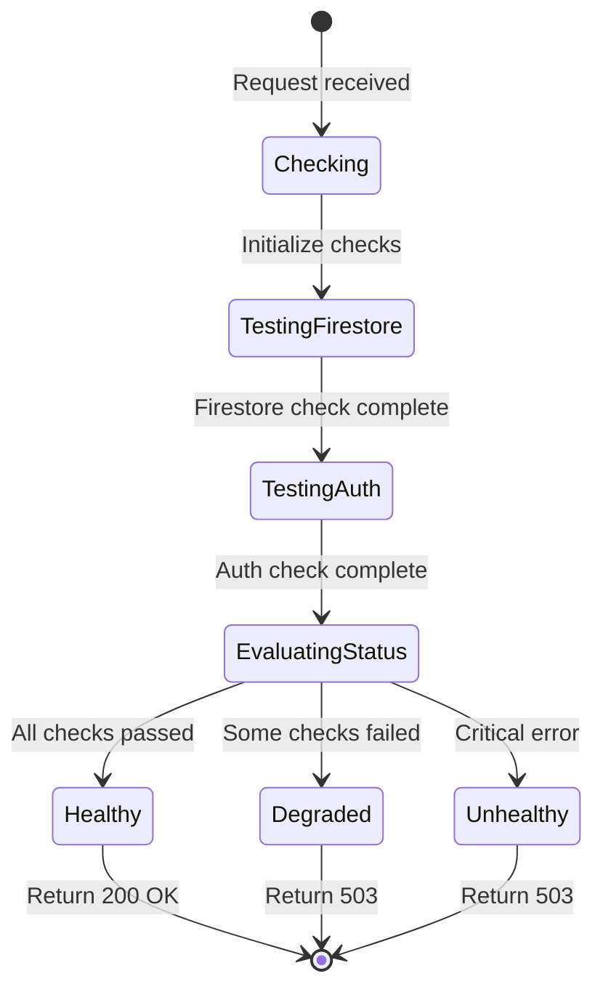
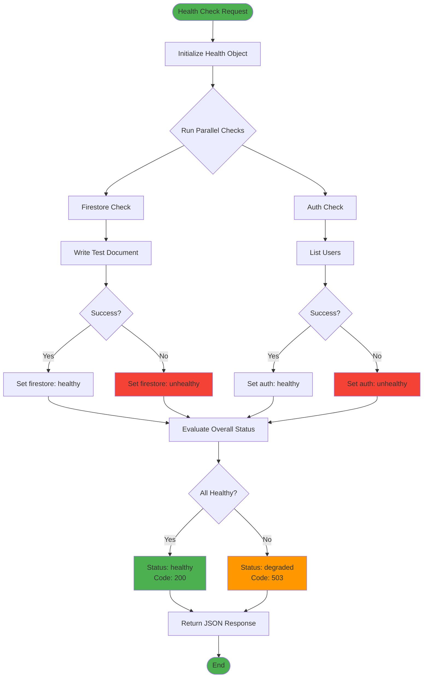
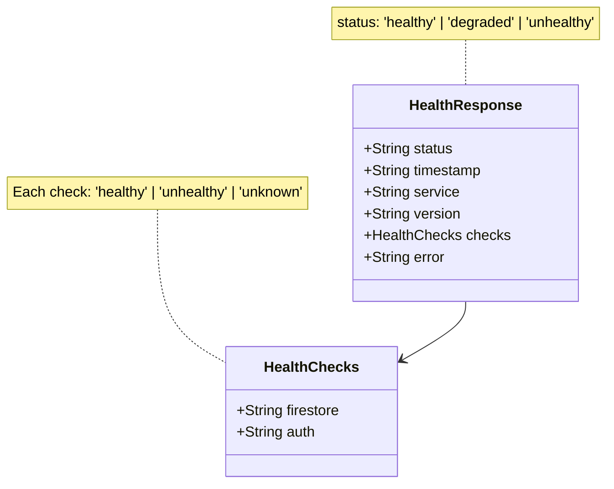
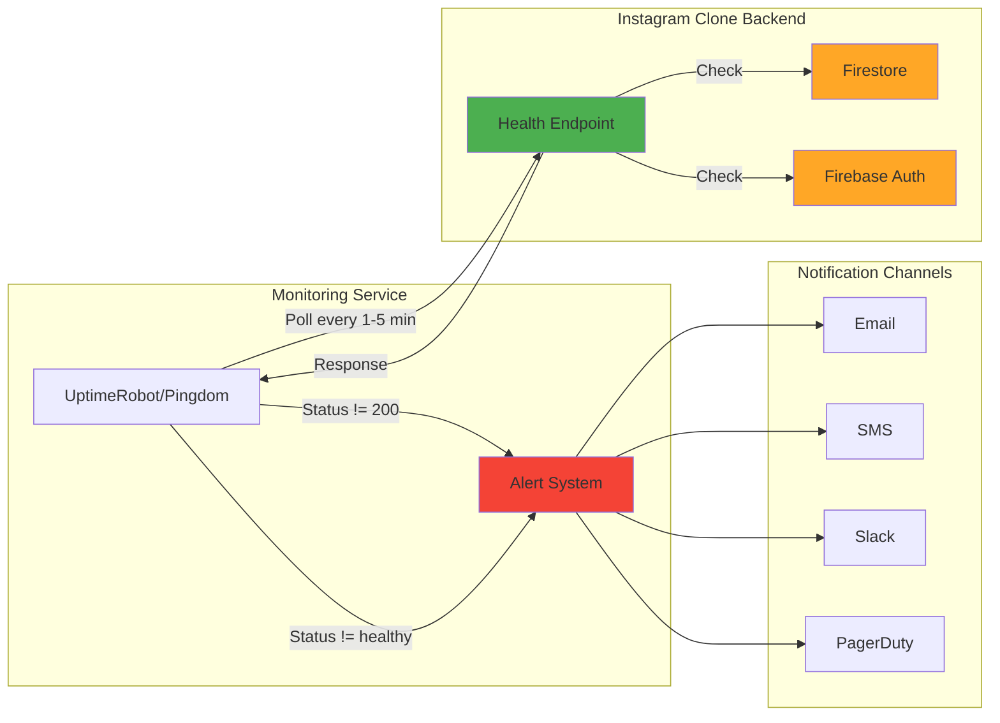
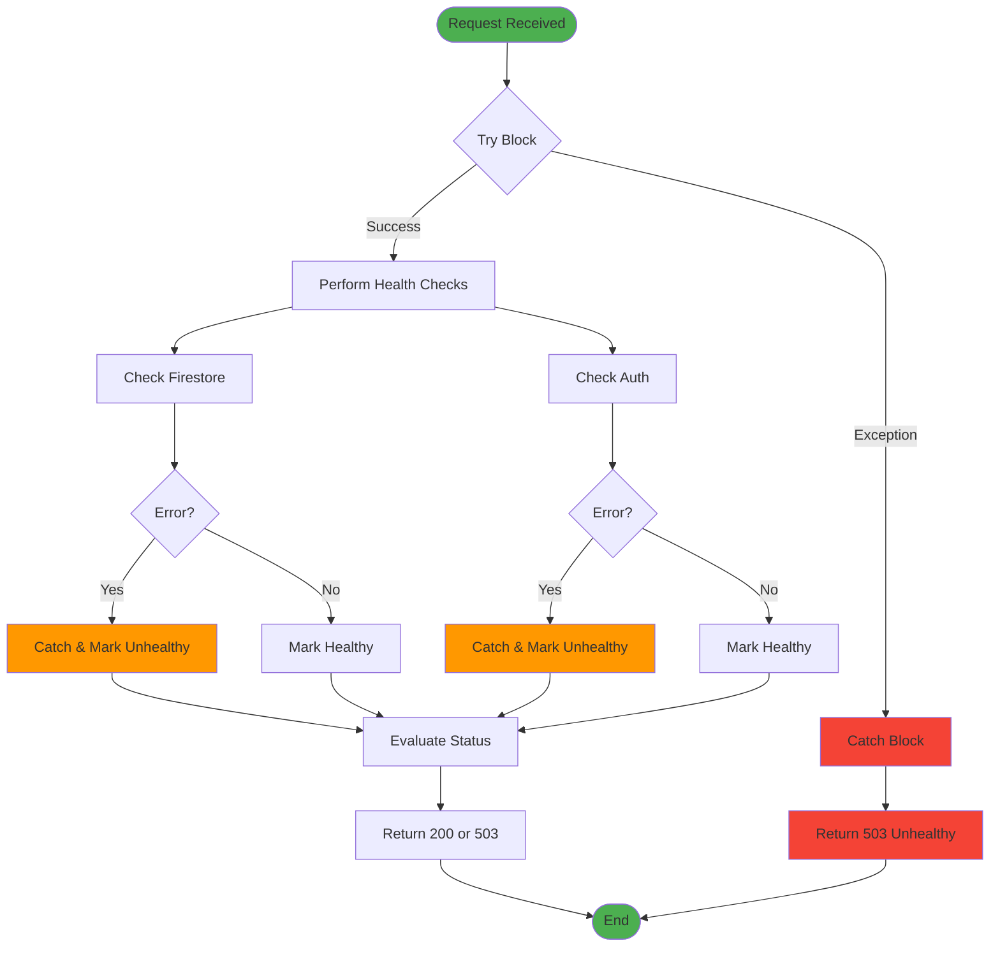

# Health Endpoint Flow

This document provides a visual representation of how the health endpoint works.

## Request Flow



## Health Status State Machine



## Component Health Check Logic



## Response Structure



## Monitoring Integration Flow



## Error Handling Flow



## Usage Examples

### Successful Health Check

```json
{
  "status": "healthy",
  "timestamp": "2024-01-15T10:30:00.000Z",
  "service": "instagram-clone-backend",
  "version": "1.0.0",
  "checks": {
    "firestore": "healthy",
    "auth": "healthy"
  }
}
```

### Degraded Service

```json
{
  "status": "degraded",
  "timestamp": "2024-01-15T10:30:00.000Z",
  "service": "instagram-clone-backend",
  "version": "1.0.0",
  "checks": {
    "firestore": "unhealthy",
    "auth": "healthy"
  }
}
```

### Complete Failure

```json
{
  "status": "unhealthy",
  "timestamp": "2024-01-15T10:30:00.000Z",
  "service": "instagram-clone-backend",
  "error": "Unexpected error occurred"
}
```

## Performance Characteristics

- **Average Response Time**: < 500ms
- **Timeout**: 60s (Firebase Cloud Functions default)
- **Cold Start**: 1-3s (first request after idle)
- **Warm Response**: 100-300ms
- **Concurrent Requests**: Handled independently

## Best Practices

1. **Polling Interval**: 1-5 minutes for production
2. **Timeout Setting**: 10 seconds for monitoring tools
3. **Alert Threshold**: 2-3 consecutive failures before alerting
4. **Response Time Alert**: > 5 seconds
5. **Status Code Monitoring**: Alert on non-200 responses

---

For implementation details, see [HEALTH_ENDPOINT.md](HEALTH_ENDPOINT.md)
