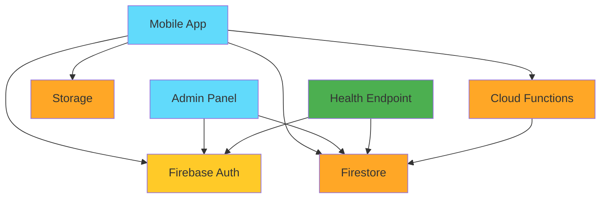

# Instagram Clone Documentation

Welcome to the Instagram Clone documentation. This directory contains comprehensive documentation about the system architecture, API endpoints, and deployment guides.

## 📚 Documentation Index

### [Architecture Documentation](./ARCHITECTURE.md)
Complete system architecture overview including:
- System architecture diagrams
- Component architecture
- Backend cloud functions
- Data model and collections
- Technology stack
- Security rules
- Key features
- Scalability considerations

### [API Reference](./API_REFERENCE.md)
Complete API endpoint reference including:
- HTTP endpoints
- Firestore trigger functions
- Deployment instructions
- Testing procedures
- Security notes

### [Health Endpoint Documentation](./HEALTH_ENDPOINT.md)
Health monitoring endpoint documentation including:
- Endpoint specifications
- Response formats
- Health check details
- Usage examples
- Monitoring integration
- Troubleshooting guide

### [Health Endpoint Flow](./HEALTH_ENDPOINT_FLOW.md)
Visual diagrams and flow charts for the health endpoint:
- Request flow sequence diagrams
- State machine diagrams
- Component health check logic
- Monitoring integration flows
- Error handling flows

## 🏗️ System Overview

This Instagram Clone is a full-stack social media application with three main components:

1. **Mobile Application** - React Native with Expo
2. **Admin Panel** - ReactJS web application
3. **Backend Services** - Firebase Cloud Functions, Firestore, and Storage

## 🚀 Quick Links

- [Main README](../README.md)
- [Backend Functions README](../backend/functions/README.md)
- [Frontend Setup](../frontend/README.md)
- [Admin Panel Setup](../admin/README.md)
- [Firebase Setup Guide](https://github.com/SimCoderYoutube/InstagramClone/wiki/Setup-your-project)

## 📊 Architecture at a Glance

## 🔧 Key Technologies

- **Frontend**: React Native, Expo SDK 42, Redux
- **Admin**: ReactJS 17, Material-UI
- **Backend**: Node.js, Firebase Cloud Functions
- **Database**: Firebase Firestore
- **Storage**: Firebase Storage
- **Auth**: Firebase Authentication
- **Notifications**: Expo Notifications
- **Monitoring**: Health check endpoint

## 🔌 API Endpoints

### HTTP Endpoints

- **GET /health** - Health check endpoint for monitoring service availability

### Firestore Triggers

- **addLike** - Increments post like count
- **removeLike** - Decrements post like count
- **addFollower** - Updates follower/following counts
- **removeFollower** - Updates follower/following counts
- **addComment** - Increments post comment count

See [API Reference](./API_REFERENCE.md) for complete details.

## 📖 Additional Resources

- [Firebase Documentation](https://firebase.google.com/docs)
- [React Native Documentation](https://reactnative.dev/docs/getting-started)
- [Expo Documentation](https://docs.expo.dev/)
- [Redux Documentation](https://redux.js.org/)

## 🤝 Contributing

When contributing to the documentation:

1. Keep diagrams up to date with code changes
2. Use clear, concise language
3. Include code examples where appropriate
4. Update the index when adding new documentation files
5. Follow the existing documentation structure

## 📝 Documentation Standards

- Use Markdown format for all documentation
- Include Mermaid diagrams for visual representations
- Provide code examples in multiple languages where applicable
- Keep documentation in sync with code changes
- Use clear headings and table of contents

## 🔍 Need Help?

- Check the [Wiki](https://github.com/SimCoderYoutube/InstagramClone/wiki)
- Open an [Issue](https://github.com/SimCoderYoutube/InstagramClone/issues)
- Watch the [YouTube Series](https://www.youtube.com/watch?v=xE8UEX7vXVQ&list=PLxabZQCAe5fgatwOQny9wKJVs4YD6xkf1)

---

Last Updated: 2024
