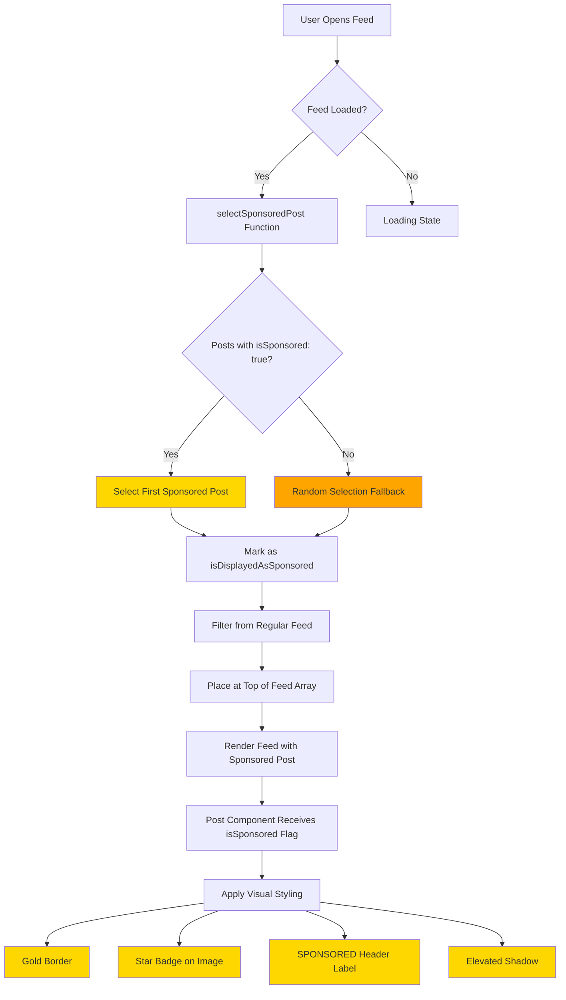
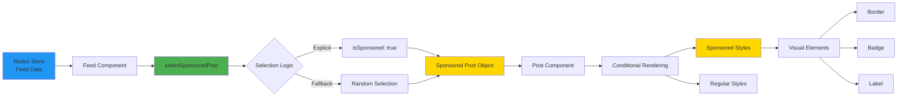

# Sponsored Posts - Visual Design Guide

## Feature Flow Diagram



## Component Architecture



## Visual Layout

```
┌─────────────────────────────────────────┐
│  ╔═══════════════════════════════════╗  │ ← Gold Border (2px)
│  ║  👤 Username  [SPONSORED]         ║  │ ← Header with Badge
│  ║                              ⋮    ║  │
│  ║  ┌─────────────────────────────┐  ║  │
│  ║  │                             │  ║  │
│  ║  │                             │  ║  │
│  ║  │      Post Image/Video       │  ║  │
│  ║  │                             │  ║  │
│  ║  │                    ┌──────┐ │  ║  │
│  ║  │                    │⭐ Spo│ │  ║  │ ← Floating Badge
│  ║  │                    │nsored│ │  ║  │
│  ║  │                    └──────┘ │  ║  │
│  ║  └─────────────────────────────┘  ║  │
│  ║  ❤️ 💬 ➤                          ║  │ ← Action Buttons
│  ║  42 likes                         ║  │
│  ║  Username: Caption text...        ║  │
│  ╚═══════════════════════════════════╝  │
│  ▼ Shadow Effect                        │
└─────────────────────────────────────────┘

Regular Post (for comparison):
┌─────────────────────────────────────────┐
│  👤 Username                        ⋮   │
│  ┌─────────────────────────────────┐    │
│  │                                 │    │
│  │      Post Image/Video           │    │
│  │                                 │    │
│  └─────────────────────────────────┘    │
│  ❤️ 💬 ➤                                │
│  42 likes                               │
│  Username: Caption text...              │
└─────────────────────────────────────────┘
```

## Color Palette

| Element | Color | Hex Code | Usage |
|---------|-------|----------|-------|
| Primary Gold | 🟡 | `#FFD700` | Border, badge background, header label |
| Text on Gold | ⚫ | `#000000` | Badge text, label text |
| Shadow | 🟡 | `#FFD700` (30% opacity) | Container shadow |
| Star Icon | ⚫ | `#000000` | Star icon in badge |

## Styling Specifications

### Container
- **Border Width**: 2px
- **Border Color**: #FFD700 (Gold)
- **Border Radius**: 8px
- **Margin Bottom**: 10px
- **Shadow**: 
  - Color: #FFD700
  - Offset: (0, 4)
  - Opacity: 0.3
  - Radius: 6
  - Elevation: 8 (Android)

### Badge (Floating)
- **Position**: Absolute (top: 10, right: 10)
- **Background**: #FFD700
- **Padding**: 12px horizontal, 6px vertical
- **Border Radius**: 12px
- **Z-Index**: 10
- **Shadow**:
  - Color: #000
  - Offset: (0, 2)
  - Opacity: 0.25
  - Radius: 3.84
  - Elevation: 5

### Header Badge
- **Background**: #FFD700
- **Padding**: 8px horizontal, 3px vertical
- **Border Radius**: 8px
- **Margin Left**: 8px
- **Font Weight**: Bold
- **Font Size**: 10px

### Badge Text
- **Color**: #000
- **Font Weight**: Bold
- **Font Size**: 11px
- **Margin Left**: 4px (after icon)

## Responsive Behavior

### Mobile (Default)
- Full-width post card
- Badge positioned in top-right corner
- Header label inline with username

### Tablet (Future)
- Maintain aspect ratio
- Scale badge proportionally
- Increase font sizes slightly

## Accessibility

- **Color Contrast**: Black text on gold background meets WCAG AA standards (4.5:1 ratio)
- **Icon + Text**: Badge uses both star icon and "Sponsored" text for clarity
- **Screen Readers**: Badge text is readable by screen readers
- **Touch Targets**: Badge is not interactive, so no touch target concerns

## Animation (Future Enhancement)

Potential animations for sponsored posts:

1. **Entrance Animation**
   - Fade in with scale (0.95 → 1.0)
   - Duration: 300ms
   - Easing: ease-out

2. **Badge Pulse**
   - Subtle scale animation (1.0 → 1.05 → 1.0)
   - Duration: 2000ms
   - Repeat: 3 times
   - Delay: 500ms after post appears

3. **Border Glow**
   - Animated shadow opacity (0.3 → 0.5 → 0.3)
   - Duration: 2000ms
   - Repeat: infinite

## Implementation Notes

### Z-Index Hierarchy
```
Badge (10)
  ↑
Video Controls (5)
  ↑
Post Content (1)
  ↑
Container (0)
```

### Performance Optimization
- Use `StyleSheet.create()` for all styles (compiled to native)
- Badge renders conditionally (only when `isSponsored === true`)
- No re-renders when scrolling (memoized components)
- Shadow uses native elevation on Android for better performance

## Testing Checklist

Visual Testing:
- [ ] Gold border visible on all screen sizes
- [ ] Badge doesn't overlap with video controls
- [ ] Badge readable on light and dark images
- [ ] Header label doesn't break layout
- [ ] Shadow visible but not overwhelming
- [ ] Consistent spacing with regular posts

Functional Testing:
- [ ] Badge appears on images
- [ ] Badge appears on videos
- [ ] Badge appears on video thumbnails
- [ ] Header label shows correctly
- [ ] Border renders on all devices
- [ ] Shadow renders on iOS and Android

## Browser/Device Compatibility

| Platform | Status | Notes |
|----------|--------|-------|
| iOS | ✅ | Full support with shadow |
| Android | ✅ | Uses elevation for shadow |
| Web (Expo) | ✅ | CSS shadow fallback |
| Tablets | ✅ | Scales appropriately |

## Future Design Iterations

1. **Gradient Border**: Replace solid gold with gradient
2. **Animated Badge**: Add subtle animation to badge
3. **Custom Icons**: Different icons for different sponsor types
4. **Themes**: Dark mode support for sponsored posts
5. **Multiple Badges**: Support for "Featured", "Trending", etc.
